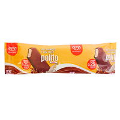

# Proyecto Minimarket

## Índice

1. [Documento ](#Documento)
  En este documento se encuentran las ejecuciones del programa y sus respectivos formatos de manera resumida 
2. [Login](#login)
3. [MenuAdmin](#menuadmin)
4. [Cajeros](#cajeros)
5. [Productos](#productos)
6. [Inventario](#inventario)
7. [Agregar Productos](#agregar-productos)
8. [Agregar Cajeros](#agregar-cajeros)
9. [Actualizar Inventario](#actualizar-inventario)
10. [Historial de Ventas](#historial-de-ventas)

### Documento

## Imágenes

### Productos





### Otros


## Documentación

### Login

```java
package LOGIN;

import ADMINISTRADOR.menuAdmin;
import CAJERO.menuCajeros;
import com.mongodb.client.*;
import org.bson.Document;
import javax.swing.*;
import java.awt.*;
import java.awt.event.ActionEvent;
import java.awt.event.ActionListener;
import java.net.URL;

/**
 * Clase que maneja el proceso de login para administradores y cajeros.
 */
public class LOGIN {
    public JPanel Login;
    private JButton iniciarSesiónButton;
    private JPasswordField passwordText;
    private JTextField userText;
    private JComboBox modosBox;
    private JLabel img;

    /**
     * Constructor de la clase LOGIN que inicializa los componentes y establece las acciones de los botones.
     */
    public LOGIN() {
        try {
            URL url = new URL("https://static.vecteezy.com/system/resources/thumbnails/019/879/186/small/user-icon-on-transparent-background-free-png.png");
            ImageIcon icon = new ImageIcon(url);
            img.setIcon(icon);
        } catch (Exception e) {
            e.printStackTrace();
        }

        iniciarSesiónButton.addActionListener(new ActionListener() {
            @Override
            public void actionPerformed(ActionEvent e) {
                switch (modosBox.getSelectedIndex()) {
                    case 1:
                        try (MongoClient mongoClient = MongoClients.create("mongodb://localhost:27017/")) {
                            System.out.println("Conexion establecida");
                            MongoDatabase database = mongoClient.getDatabase("proyecto_minimarket");
                            MongoCollection<Document> collection = database.getCollection("administradores");
                            String username = userText.getText();
                            String password = passwordText.getText();
                            FindIterable<Document> documents = collection.find(new Document("user", userText.getText()).append("password", passwordText.getText()));

                            if (documents.first() != null) {
                                String user = (String) documents.first().get("user");
                                String pass = (String) documents.first().get("password");

                                if (user.equals(username) && pass.equals(password)) {
                                    JFrame currentFrame = (JFrame) SwingUtilities.getWindowAncestor(Login);
                                    if (currentFrame != null) {
                                        currentFrame.setVisible(false);
                                    }

                                    JFrame menu = new JFrame();
                                    menu.setContentPane(new menuAdmin().menuAdmin);
                                    menu.setDefaultCloseOperation(JFrame.EXIT_ON_CLOSE);
                                    menu.pack();
                                    menu.setSize(700, 500);
                                    menu.setLocationRelativeTo(null);
                                    menu.setVisible(true);
                                    new menuAdmin();
                                }
                            } else {
                                JOptionPane.showMessageDialog(null, "Usuario o contraseña incorrecta");
                            }
                        }
                        break;

                    case 2:
                        try (MongoClient mongoClient = MongoClients.create("mongodb://localhost:27017/")) {
                            System.out.println("Conexion establecida");
                            MongoDatabase database = mongoClient.getDatabase("proyecto_minimarket");
                            MongoCollection<Document> collection = database.getCollection("cajeros");
                            String username = userText.getText();
                            String password = passwordText.getText();
                            FindIterable<Document> documents = collection.find(new Document("user", userText.getText()).append("password", passwordText.getText()));

                            if (documents.first() != null) {
                                String user = (String) documents.first().get("user");
                                String pass = (String) documents.first().get("password");

                                if (user.equals(username) && pass.equals(password)) {
                                    JFrame currentFrame = (JFrame) SwingUtilities.getWindowAncestor(Login);
                                    if (currentFrame != null) {
                                        currentFrame.setVisible(false);
                                    }

                                    JFrame menu = new JFrame();
                                    menu.setContentPane(new menuCajeros().menuCaja);
                                    menu.setDefaultCloseOperation(JFrame.EXIT_ON_CLOSE);
                                    menu.pack();
                                    menu.setSize(700, 500);
                                    menu.setLocationRelativeTo(null);
                                    menu.setVisible(true);
                                    new menuAdmin();
                                }
                            } else {
                                JOptionPane.showMessageDialog(null, "Usuario o contraseña incorrecta");
                            }
                        }
                        break;
                }
            }
        });
    }

    /**
     * Método que retorna el contenedor principal de la interfaz de login.
     *
     * @return El contenedor principal de la interfaz de login.
     */
    public Container LOGIN() {
        return Login;
    }
}
```

### MenuAdmin

```java
package ADMINISTRADOR;

import LOGIN.LOGIN;
import javax.swing.*;
import java.awt.event.ActionEvent;
import java.awt.event.ActionListener;

/**
 * Clase que representa el menú del administrador en el minimarket.
 */
public class menuAdmin {
    private JButton historialDeVentasButton;
    public JPanel menuAdmin;
    private JButton agregarCajerosButton;
    private JButton actualizarInventarioButton;
    private JButton cerrarSesionButton;
    private JLabel imgInventario;
    private JLabel imgHistorial;
    private JLabel imgACajeros;

    /**
     * Constructor de la clase menuAdmin que inicializa los componentes y establece las acciones de los botones.
     */
    public menuAdmin() {
        try {
            String imagePath = "imagenes/inventario1.png";
            ImageIcon imageIcon = new ImageIcon(imagePath);
            imgInventario.setIcon(imageIcon);

            String imagePath2 = "imagenes/ventas.png";
            ImageIcon imageIcon2 = new ImageIcon(imagePath2);
            imgHistorial.setIcon(imageIcon2);

            String imagePath3 = "imagenes/cajero.png";
            ImageIcon imageIcon3 = new ImageIcon(imagePath3);
            imgACajeros.setIcon(imageIcon3);
        } catch (Exception e) {
            e.printStackTrace();
        }

        actualizarInventarioButton.addActionListener(new ActionListener() {
            @Override
            public void actionPerformed(ActionEvent e) {
                JFrame currentFrame = (JFrame) SwingUtilities.getWindowAncestor(menuAdmin);
                if (currentFrame != null) {
                    currentFrame.setVisible(false);
                }

                JFrame inventarioFrame = new JFrame("Inventario");
                inventarioFrame.setContentPane(new inventario().Inventaio);
                inventarioFrame.setDefaultCloseOperation(JFrame.EXIT_ON_CLOSE);
                inventarioFrame.pack();
                inventarioFrame.setSize(600, 500);
                inventarioFrame.setLocationRelativeTo(null);
                inventarioFrame.setVisible(true);
            }
        });

        historialDeVentasButton.addActionListener(new ActionListener() {
            @Override
            public void actionPerformed(ActionEvent e) {
                JFrame currentFrame = (JFrame) SwingUtilities.getWindowAncestor(menuAdmin);
                if (currentFrame != null) {
                    currentFrame.setVisible(false);
                }

                JFrame historialFrame = new JFrame("Historial de Ventas");
                historialFrame.setContentPane(new historial().HistVentas);
                historialFrame.setDefaultCloseOperation(JFrame.EXIT_ON_CLOSE);
                historialFrame.pack();
                historialFrame.setSize(600, 500);
                historialFrame.setLocationRelativeTo(null);
                historialFrame.setVisible(true);
            }
        });

        agregarCajerosButton.addActionListener(new ActionListener() {
            @Override
            public void actionPerformed(ActionEvent e) {
                JFrame currentFrame = (JFrame) SwingUtilities.getWindowAncestor(menuAdmin);
                if (currentFrame != null) {
                    currentFrame.setVisible(false);
                }

                JFrame agregarCajerosFrame = new JFrame("Agregar Cajeros");
                agregarCajerosFrame.setContentPane(new AgregarCajeros().ACajeros);
                agregarCajerosFrame.setDefaultCloseOperation(JFrame.EXIT_ON_CLOSE);
                agregarCajerosFrame.pack();
                agregarCajerosFrame.setSize(600, 500);
                agregarCajerosFrame.setLocationRelativeTo(null);
                agregarCajerosFrame.setVisible(true);
            }
        });

        cerrarSesionButton.addActionListener(new ActionListener() {
            @Override
            public void actionPerformed(ActionEvent e) {
                JFrame currentFrame = (JFrame) SwingUtilities.getWindowAncestor(menuAdmin);
                if (currentFrame != null) {
                    currentFrame.setVisible(false);
                }

                JFrame loginFrame = new JFrame("Login");
                loginFrame.setContentPane(new LOGIN().LOGIN());
                loginFrame.setDefaultCloseOperation(JFrame.EXIT_ON_CLOSE);
                loginFrame.pack();
                loginFrame.setSize(400, 500);
                loginFrame.setLocationRelativeTo(null);
                loginFrame.setVisible(true);
            }
        });
    }
}
```

### Cajeros

```java
import org.bson.Document;

/**
 * Clase que representa un cajero en el minimarket.
 */
public class Cajeros

 {
    private String userC;
    private String passC;

    /**
     * Constructor por defecto.
     */
    public Cajeros() {
    }

    /**
     * Constructor que inicializa un cajero con los datos especificados.
     *
     * @param userC El nombre de usuario del cajero.
     * @param passC La contraseña del cajero.
     */
    public Cajeros(String userC, String passC) {
        this.userC = userC;
        this.passC = passC;
    }

    /**
     * Obtiene el nombre de usuario del cajero.
     *
     * @return El nombre de usuario del cajero.
     */
    public String getUserC() {
        return userC;
    }

    /**
     * Establece el nombre de usuario del cajero.
     *
     * @param userC El nombre de usuario del cajero.
     */
    public void setUserC(String userC) {
        this.userC = userC;
    }

    /**
     * Obtiene la contraseña del cajero.
     *
     * @return La contraseña del cajero.
     */
    public String getPassC() {
        return passC;
    }

    /**
     * Establece la contraseña del cajero.
     *
     * @param passC La contraseña del cajero.
     */
    public void setPassC(String passC) {
        this.passC = passC;
    }
}
```

### Productos

```java
import org.bson.Document;

/**
 * Clase que representa un producto en el minimarket.
 */
public class Productos {
    private String codigo;
    private String nombre;
    private double precio;
    private int cantidad;

    /**
     * Constructor por defecto.
     */
    public Productos() {
    }

    /**
     * Constructor que inicializa un producto con los datos especificados.
     * 
     * @param codigo   El código del producto.
     * @param nombre   El nombre del producto.
     * @param precio   El precio del producto.
     * @param cantidad La cantidad del producto.
     */
    public Productos(String codigo, String nombre, double precio, int cantidad) {
        this.codigo = codigo;
        this.nombre = nombre;
        this.precio = precio;
        this.cantidad = cantidad;
    }

    /**
     * Obtiene el código del producto.
     * 
     * @return El código del producto.
     */
    public String getCodigo() {
        return codigo;
    }

    /**
     * Establece el código del producto.
     * 
     * @param codigo El código del producto.
     */
    public void setCodigo(String codigo) {
        this.codigo = codigo;
    }

    /**
     * Obtiene el nombre del producto.
     * 
     * @return El nombre del producto.
     */
    public String getNombre() {
        return nombre;
    }

    /**
     * Establece el nombre del producto.
     * 
     * @param nombre El nombre del producto.
     */
    public void setNombre(String nombre) {
        this.nombre = nombre;
    }

    /**
     * Obtiene el precio del producto.
     * 
     * @return El precio del producto.
     */
    public double getPrecio() {
        return precio;
    }

    /**
     * Establece el precio del producto.
     * 
     * @param precio El precio del producto.
     */
    public void setPrecio(double precio) {
        this.precio = precio;
    }

    /**
     * Obtiene la cantidad del producto.
     * 
     * @return La cantidad del producto.
     */
    public int getCantidad() {
        return cantidad;
    }

    /**
     * Establece la cantidad del producto.
     * 
     * @param cantidad La cantidad del producto.
     */
    public void setCantidad(int cantidad) {
        this.cantidad = cantidad;
    }
}
```

### Inventario

```java
package ADMINISTRADOR;

import com.mongodb.client.MongoClient;
import com.mongodb.client.MongoClients;
import com.mongodb.client.MongoCollection;
import com.mongodb.client.MongoDatabase;
import org.bson.Document;
import org.bson.types.Binary;

import javax.imageio.ImageIO;
import javax.swing.*;
import java.awt.event.ActionEvent;
import java.awt.event.ActionListener;
import java.awt.image.BufferedImage;
import java.io.ByteArrayInputStream;
import java.io.IOException;
import java.util.ArrayList;
import java.util.List;
import javax.imageio.ImageIO;

/**
 * Clase que representa el inventario de productos en el minimarket.
 */
public class inventario {
    public JPanel Inventaio;
    private JButton button1;
    private JLabel idTxt;
    private JLabel nombreTxt;
    private JLabel cantidadTxt;
    private JLabel precioTxt;
    private JButton anteriorProductoButton;
    private JButton siguienteProductoButton;
    private JLabel productImg;
    private JButton actualizarInventarioButton;
    private JButton agrergarProductosButton;

    private List<Document> productos;
    private int currentIndex;

    /**
     * Constructor de la clase inventario que inicializa los componentes y establece las acciones de los botones.
     */
    public inventario() {
        productos = fetchProductosFromDB();
        currentIndex = 0;
        displayProducto(currentIndex);

        button1.addActionListener(new ActionListener() {
            @Override
            public void actionPerformed(ActionEvent e) {
                JFrame currentFrame = (JFrame) SwingUtilities.getWindowAncestor(Inventaio);
                if (currentFrame != null) {
                    currentFrame.setVisible(false);
                }

                JFrame MenuAdminFrame = new JFrame("Menu Administrador");
                MenuAdminFrame.setContentPane(new menuAdmin().menuAdmin);
                MenuAdminFrame.setDefaultCloseOperation(JFrame.EXIT_ON_CLOSE);
                MenuAdminFrame.pack();
                MenuAdminFrame.setSize(700, 500);
                MenuAdminFrame.setLocationRelativeTo(null);
                MenuAdminFrame.setVisible(true);
            }
        });

        siguienteProductoButton.addActionListener(new ActionListener() {
            @Override
            public void actionPerformed(ActionEvent e) {
                if (currentIndex < productos.size() - 1) {
                    currentIndex++;
                    displayProducto(currentIndex);
                }
            }
        });

        anteriorProductoButton.addActionListener(new ActionListener() {
            @Override
            public void actionPerformed(ActionEvent e) {
                if (currentIndex > 0) {
                    currentIndex--;
                    displayProducto(currentIndex);
                }
            }
        });
        actualizarInventarioButton.addActionListener(new ActionListener() {
            @Override
            public void actionPerformed(ActionEvent e) {
                JFrame currentFrame = (JFrame) SwingUtilities.getWindowAncestor(Inventaio);
                if (currentFrame != null) {
                    currentFrame.setVisible(false);
                }

                JFrame inventarioFrame = new JFrame("Actualizar Inventario");
                inventarioFrame.setContentPane(new ActualizarInventario().UpdateInv);
                inventarioFrame.setDefaultCloseOperation(JFrame.EXIT_ON_CLOSE);
                inventarioFrame.pack();
                inventarioFrame.setSize(600, 500);
                inventarioFrame.setLocationRelativeTo(null);
                inventarioFrame.setVisible(true);
            }
        });
        agrergarProductosButton.addActionListener(new ActionListener() {
            @Override
            public void actionPerformed(ActionEvent e) {
                JFrame currentFrame = (JFrame) SwingUtilities.getWindowAncestor(Inventaio);
                if (currentFrame != null) {
                    currentFrame.setVisible(false);
                }

                JFrame inventarioFrame = new JFrame("Agregar Productos");
                inventarioFrame.setContentPane(new AgregrarProductos().AgreProd);
                inventarioFrame.setDefaultCloseOperation(JFrame.EXIT_ON_CLOSE);
                inventarioFrame.pack();
                inventarioFrame.setSize(600, 500);
                inventarioFrame.setLocationRelativeTo(null);
                inventarioFrame.setVisible(true);
            }
        });
    }

    /**
     * Obtiene una lista de productos desde la base de datos.
     *
     * @return La lista de productos.
     */
    private List<Document> fetchProductosFromDB() {
        List<Document> productosList = new ArrayList<>();

        try (MongoClient mongoClient = MongoClients.create("mongodb://localhost:27017/")) {
            System.out.println("Conexion establecida");
            MongoDatabase database = mongoClient.getDatabase("proyecto_minimarket");
            MongoCollection<Document> collection = database.getCollection("productos");

            for (Document doc : collection.find()) {
                productosList.add(doc);
            }
        }
        return productosList;
    }

    /**
     * Muestra los datos del producto en el índice especificado.
     *
     * @param index El índice del producto a mostrar.
     */
    private void displayProducto(int index) {
        if (index >= 0 && index < productos.size()) {
            Document producto = productos.get(index);
            idTxt.setText(producto.getString("codigo"));
            nombreTxt.setText(producto.getString("nombre"));
            cantidadTxt.setText(String.valueOf(producto.getInteger("cantidad")));
            precioTxt.setText(String.valueOf(producto.getDouble("precio")));

            Object imgField = producto.get("img");
            if (imgField instanceof Binary) {
                Binary imgBinary = (Binary) imgField;
                byte[] imgBytes = imgBinary.getData();

                try (ByteArrayInputStream bais = new ByteArrayInputStream(imgBytes)) {
                    BufferedImage img = ImageIO.read(bais);
                    ImageIcon imageIcon = new ImageIcon(img);
                    productImg.setIcon(imageIcon);
                } catch (IOException e) {
                    e.printStackTrace();
                }
            } else {
                productImg.setIcon(null);
            }
        }
    }
}
```

### Agregar Productos

```java
package ADMINISTRADOR;

import com.mongodb.client.MongoClient;
import com.mongodb.client.MongoClients;
import com.mongodb.client.MongoCollection;
import com.mongodb.client.MongoDatabase;
import

 org.bson.Document;

import javax.imageio.ImageIO;
import javax.swing.*;
import java.awt.*;
import java.awt.event.ActionEvent;
import java.awt.event.ActionListener;
import java.awt.image.BufferedImage;
import java.io.ByteArrayOutputStream;
import java.io.File;
import java.io.IOException;

/**
 * Clase que representa la interfaz para agregar productos al inventario del minimarket.
 */
public class AgregrarProductos {
    private JButton regresarButton;
    private JTextField codigoTxt;
    private JTextField nameTxt;
    private JTextField cantidadTxt;
    private JTextField precioTxt;
    private JLabel imgLabel;
    private JButton agregarProductoButton;
    public JPanel AgreProd;
    private JButton seleccionarImagenButton;
    private JFileChooser fileChooser;
    private byte[] imgBytes;

    /**
     * Constructor de la clase AgregrarProductos que inicializa los componentes y establece las acciones de los botones.
     */
    public AgregrarProductos() {
        fileChooser = new JFileChooser();
        fileChooser.setFileSelectionMode(JFileChooser.FILES_ONLY);

        regresarButton.addActionListener(new ActionListener() {
            @Override
            public void actionPerformed(ActionEvent e) {
                JFrame currentFrame = (JFrame) SwingUtilities.getWindowAncestor(AgreProd);
                if (currentFrame != null) {
                    currentFrame.setVisible(false);
                }

                JFrame MenuAdminFrame = new JFrame("Inventario");
                MenuAdminFrame.setContentPane(new inventario().Inventaio);
                MenuAdminFrame.setDefaultCloseOperation(JFrame.EXIT_ON_CLOSE);
                MenuAdminFrame.pack();
                MenuAdminFrame.setSize(700, 500);
                MenuAdminFrame.setLocationRelativeTo(null);
                MenuAdminFrame.setVisible(true);
            }
        });

        agregarProductoButton.addActionListener(new ActionListener() {
            @Override
            public void actionPerformed(ActionEvent e) {
                String codigo = codigoTxt.getText();
                String nombre = nameTxt.getText();
                String cantidad = cantidadTxt.getText();
                String precio = precioTxt.getText();

                if (codigo.isEmpty() || nombre.isEmpty() || cantidad.isEmpty() || precio.isEmpty() || imgBytes == null) {
                    JOptionPane.showMessageDialog(null, "Por favor, complete todos los campos y seleccione una imagen.");
                    return;
                }

                try (MongoClient mongoClient = MongoClients.create("mongodb://localhost:27017/")) {
                    MongoDatabase database = mongoClient.getDatabase("proyecto_minimarket");
                    MongoCollection<Document> collection = database.getCollection("productos");

                    Document query = new Document("codigo", codigo);
                    if (collection.find(query).first() != null) {
                        JOptionPane.showMessageDialog(null, "El código de producto ya existe.");
                        return;
                    }

                    Document document = new Document("codigo", codigo)
                            .append("nombre", nombre)
                            .append("cantidad", Integer.parseInt(cantidad))
                            .append("precio", Double.parseDouble(precio))
                            .append("img", imgBytes);
                    collection.insertOne(document);

                    JOptionPane.showMessageDialog(null, "Producto agregado exitosamente.");
                } catch (NumberFormatException ex) {
                    JOptionPane.showMessageDialog(null, "Por favor, ingrese valores válidos para precio y cantidad.");
                } catch (Exception ex) {
                    ex.printStackTrace();
                    JOptionPane.showMessageDialog(null, "Error al agregar el producto.");
                }
            }
        });

        seleccionarImagenButton.addActionListener(new ActionListener() {
            @Override
            public void actionPerformed(ActionEvent e) {
                int returnValue = fileChooser.showOpenDialog(null);
                if (returnValue == JFileChooser.APPROVE_OPTION) {
                    File selectedFile = fileChooser.getSelectedFile();
                    try {
                        BufferedImage img = ImageIO.read(selectedFile);

                        if (imgLabel.getWidth() == 0 || imgLabel.getHeight() == 0) {
                            imgLabel.setSize(200, 200);
                        }

                        imgLabel.setIcon(new ImageIcon(img.getScaledInstance(imgLabel.getWidth(), imgLabel.getHeight(), Image.SCALE_SMOOTH)));

                        ByteArrayOutputStream baos = new ByteArrayOutputStream();
                        ImageIO.write(img, "png", baos);
                        imgBytes = baos.toByteArray();
                    } catch (IOException ex) {
                        ex.printStackTrace();
                    }
                }
            }
        });
    }
}
```

### Agregar Cajeros

```java
package ADMINISTRADOR;

import com.mongodb.client.MongoClient;
import com.mongodb.client.MongoClients;
import com.mongodb.client.MongoCollection;
import com.mongodb.client.MongoDatabase;
import org.bson.Document;

import javax.swing.*;
import java.awt.event.ActionEvent;
import java.awt.event.ActionListener;

/**
 * Clase que representa la interfaz para agregar cajeros en el minimarket.
 */
public class AgregarCajeros {
    public JPanel ACajeros;
    private JButton agregarCajeroButton;
    private JTextField textField1;
    private JTextField textField2;
    private JButton menuPrincipalButton;

    /**
     * Constructor de la clase AgregarCajeros que inicializa los componentes y establece las acciones de los botones.
     */
    public AgregarCajeros() {
        menuPrincipalButton.addActionListener(new ActionListener() {
            @Override
            public void actionPerformed(ActionEvent e) {
                JFrame currentFrame = (JFrame) SwingUtilities.getWindowAncestor(ACajeros);
                if (currentFrame != null) {
                    currentFrame.setVisible(false);
                }

                JFrame MenuAdminFrame = new JFrame("Agregar Cajeros");
                MenuAdminFrame.setContentPane(new menuAdmin().menuAdmin);
                MenuAdminFrame.setDefaultCloseOperation(JFrame.EXIT_ON_CLOSE);
                MenuAdminFrame.pack();
                MenuAdminFrame.setSize(700, 500);
                MenuAdminFrame.setLocationRelativeTo(null);
                MenuAdminFrame.setVisible(true);
            }
        });

        agregarCajeroButton.addActionListener(new ActionListener() {
            @Override
            public void actionPerformed(ActionEvent e) {
                String username = textField1.getText();
                String password = textField2.getText();

                if (username.isEmpty() || password.isEmpty()) {
                    JOptionPane.showMessageDialog(null, "Por favor, complete todos los campos.");
                    return;
                }

                try (MongoClient mongoClient = MongoClients.create("mongodb://localhost:27017/")) {
                    MongoDatabase database = mongoClient.getDatabase("proyecto_minimarket");
                    MongoCollection<Document> collection = database.getCollection("cajeros");

                    Document query = new Document("user", username);
                    if (collection.find(query).first() != null) {
                        JOptionPane.showMessageDialog(null, "El nombre de usuario ya existe.");
                        return;
                    }

                    Document document = new Document("user", username)
                            .append("password", password);
                    collection.insertOne(document);

                    JOptionPane.showMessageDialog(null, "Cajero agregado exitosamente.");
                } catch (Exception ex) {
                    ex.printStackTrace();
                    JOptionPane.showMessageDialog(null, "Error al agregar el cajero.");
                }
            }
        });
    }
}
```

### Actualizar Inventario

```java
package ADMINISTRADOR;

import com.mongodb.client.MongoClient;
import com.mongodb.client.MongoClients;
import com.mongodb.client.MongoCollection;
import com.mongodb.client.MongoDatabase;
import com.mongodb.client.result.UpdateResult;
import org.bson.Document;
import org.bson.types.Binary;

import javax.imageio.ImageIO;
import javax.swing.*;
import java.awt.*;
import java.awt.event.ActionEvent;
import java.awt.event.ActionListener;
import java.awt.image.BufferedImage;
import java.io.ByteArrayInputStream;
import java.io.ByteArrayOutputStream;
import java.io.File;
import java.io.IOException;
import java.util.ArrayList;
import java.util.List;

/**
 * Clase que representa la interfaz para actualizar productos en el inventario del minimarket.
 */
public class ActualizarInventario {
    public JPanel UpdateInv;
    private JButton regresarButton;
    private JTextField codigoTxt;
    private JButton actualizarButton;
    private JTextField precioTxt;
    private JTextField cantidadTxt;
    private JButton seleccionarImagenButton;
    private JLabel imgLabel;
    private JButton anteriorButton;
    private JButton siguienteButton;
    private JFileChooser fileChooser;
    private byte[] imgBytes;

    private List<Document> productos;
    private int currentIndex;

    /**
     * Constructor de la clase ActualizarInventario que inicializa los componentes y establece las acciones de los botones.
     */
    public ActualizarInventario() {
        productos = fetchProductosFromDB();
        currentIndex = 0;
        displayProducto(currentIndex);

        imgLabel.setPreferredSize(new Dimension(200, 200));
        fileChooser = new JFileChooser();
        fileChooser.setFileSelectionMode(JFileChooser.FILES_ONLY);

        actualizarButton.addActionListener(new ActionListener() {
            @Override
            public void actionPerformed(ActionEvent e) {
                String codigo = codigoTxt.getText();

                if (precioTxt.getText().isEmpty() || cantidadTxt.getText().isEmpty()) {
                    JOptionPane.showMessageDialog(null, "Por favor, complete todos los campos.");
                    return;
                }

                double precio;
                int cantidad;

                try {
                    precio = Double.parseDouble(precioTxt.getText());
                    cantidad = Integer.parseInt(cantidadTxt.getText());
                } catch (NumberFormatException ex) {
                    JOptionPane.showMessageDialog(null, "Por favor, ingrese valores válidos para precio y cantidad.");
                    return;
                }

                try (var mongoClient = MongoClients.create("mongodb://localhost:27017")) {
                    MongoDatabase database = mongoClient.getDatabase("proyecto_minimarket");
                    MongoCollection<Document> collection = database.getCollection("productos");

                    Document query = new Document("codigo", codigo);
                    Document update = new Document("$set",

 new Document("precio", precio).append("cantidad", cantidad));
                    if (imgBytes != null) {
                        update.append("$set", new Document("img", imgBytes));
                    }

                    UpdateResult result = collection.updateOne(query, update);

                    if (result.getMatchedCount() == 0) {
                        JOptionPane.showMessageDialog(null, "Código de producto no encontrado.");
                    } else {
                        JOptionPane.showMessageDialog(null, "Producto actualizado correctamente.");
                    }
                } catch (Exception ex) {
                    JOptionPane.showMessageDialog(null, "Error al actualizar el producto: " + ex.getMessage());
                }
            }
        });

        seleccionarImagenButton.addActionListener(new ActionListener() {
            @Override
            public void actionPerformed(ActionEvent e) {
                int returnValue = fileChooser.showOpenDialog(null);
                if (returnValue == JFileChooser.APPROVE_OPTION) {
                    File selectedFile = fileChooser.getSelectedFile();
                    try {
                        BufferedImage img = ImageIO.read(selectedFile);

                        if (imgLabel.getWidth() == 0 || imgLabel.getHeight() == 0) {
                            imgLabel.setSize(200, 200);
                        }

                        imgLabel.setIcon(new ImageIcon(img.getScaledInstance(imgLabel.getWidth(), imgLabel.getHeight(), Image.SCALE_SMOOTH)));

                        ByteArrayOutputStream baos = new ByteArrayOutputStream();
                        ImageIO.write(img, "png", baos);
                        imgBytes = baos.toByteArray();
                    } catch (IOException ex) {
                        ex.printStackTrace();
                    }
                }
            }
        });

        regresarButton.addActionListener(new ActionListener() {
            @Override
            public void actionPerformed(ActionEvent e) {
                JFrame currentFrame = (JFrame) SwingUtilities.getWindowAncestor(UpdateInv);
                if (currentFrame != null) {
                    currentFrame.setVisible(false);
                }

                JFrame MenuAdminFrame = new JFrame("Inventario de Productos");
                MenuAdminFrame.setContentPane(new inventario().Inventaio);
                MenuAdminFrame.setDefaultCloseOperation(JFrame.EXIT_ON_CLOSE);
                MenuAdminFrame.pack();
                MenuAdminFrame.setSize(700, 500);
                MenuAdminFrame.setLocationRelativeTo(null);
                MenuAdminFrame.setVisible(true);
            }
        });

        anteriorButton.addActionListener(new ActionListener() {
            @Override
            public void actionPerformed(ActionEvent e) {
                if (currentIndex > 0) {
                    currentIndex--;
                    displayProducto(currentIndex);
                }
            }
        });

        siguienteButton.addActionListener(new ActionListener() {
            @Override
            public void actionPerformed(ActionEvent e) {
                if (currentIndex < productos.size() - 1) {
                    currentIndex++;
                    displayProducto(currentIndex);
                }
            }
        });
    }

    /**
     * Obtiene una lista de productos desde la base de datos.
     *
     * @return La lista de productos.
     */
    private List<Document> fetchProductosFromDB() {
        List<Document> productosList = new ArrayList<>();

        try (MongoClient mongoClient = MongoClients.create("mongodb://localhost:27017/")) {
            System.out.println("Conexion establecida");
            MongoDatabase database = mongoClient.getDatabase("proyecto_minimarket");
            MongoCollection<Document> collection = database.getCollection("productos");

            for (Object doc : collection.find()) {
                productosList.add((Document) doc);
            }
        }
        return productosList;
    }

    /**
     * Muestra los datos del producto en el índice especificado.
     *
     * @param index El índice del producto a mostrar.
     */
    private void displayProducto(int index) {
        if (index >= 0 && index < productos.size()) {
            Document producto = productos.get(index);
            codigoTxt.setText(producto.getString("codigo"));
            cantidadTxt.setText(String.valueOf(producto.getInteger("cantidad")));
            precioTxt.setText(String.valueOf(producto.getDouble("precio")));

            Object imgField = producto.get("img");
            if (imgField instanceof Binary) {
                Binary imgBinary = (Binary) imgField;
                byte[] imgBytes = imgBinary.getData();

                try (ByteArrayInputStream bais = new ByteArrayInputStream(imgBytes)) {
                    BufferedImage img = ImageIO.read(bais);
                    ImageIcon imageIcon = new ImageIcon(img);
                    imgLabel.setIcon(imageIcon);
                } catch (IOException e) {
                    e.printStackTrace();
                }
            } else {
                imgLabel.setIcon(null);
            }
        }
    }
}
```

### Historial de Ventas

```java
package ADMINISTRADOR;

import com.mongodb.client.MongoClient;
import com.mongodb.client.MongoClients;
import com.mongodb.client.MongoCollection;
import com.mongodb.client.MongoDatabase;
import org.bson.Document;

import javax.swing.*;
import java.awt.*;
import java.awt.event.ActionEvent;
import java.awt.event.ActionListener;
import java.io.File;
import java.io.IOException;
import java.text.SimpleDateFormat;
import java.util.ArrayList;
import java.util.Date;
import java.util.List;

/**
 * Clase que representa el historial de ventas en el minimarket.
 */
public class historial {
    public JPanel HistVentas;
    private JButton menuPrincipalButton;
    private JLabel NumVentas;
    private JButton anteriorButton;
    private JButton siguienteButton;
    private JLabel ventaIDtxt;
    private JLabel fechatxt;
    private JLabel totaltxt;
    private JButton abrirReciboButton;

    private List<Document> recibos;
    private int currentIndex;

    /**
     * Constructor de la clase historial que inicializa los componentes y establece las acciones de los botones.
     */
    public historial() {
        currentIndex = 0;
        recibos = fetchVentasFromDB();
        if (!recibos.isEmpty()) {
            displayRecibo(currentIndex);
        }

        menuPrincipalButton.addActionListener(new ActionListener() {
            @Override
            public void actionPerformed(ActionEvent e) {
                JFrame currentFrame = (JFrame) SwingUtilities.getWindowAncestor(HistVentas);
                if (currentFrame != null) {
                    currentFrame.setVisible(false);
                }

                JFrame MenuAdminFrame = new JFrame("Menu Administrador");
                MenuAdminFrame.setContentPane(new menuAdmin().menuAdmin);
                MenuAdminFrame.setDefaultCloseOperation(JFrame.EXIT_ON_CLOSE);
                MenuAdminFrame.pack();
                MenuAdminFrame.setSize(700, 500);
                MenuAdminFrame.setLocationRelativeTo(null);
                MenuAdminFrame.setVisible(true);
            }
        });

        anteriorButton.addActionListener(new ActionListener() {
            @Override
            public void actionPerformed(ActionEvent e) {
                if (currentIndex > 0) {
                    currentIndex--;
                    displayRecibo(currentIndex);
                }
            }
        });

        siguienteButton.addActionListener(new ActionListener() {
            @Override
            public void actionPerformed(ActionEvent e) {
                if (currentIndex < recibos.size() - 1) {
                    currentIndex++;
                    displayRecibo(currentIndex);
                }
            }
        });

        abrirReciboButton.addActionListener(new ActionListener() {
            @Override
            public void actionPerformed(ActionEvent e) {
                if (currentIndex >= 0 && currentIndex < recibos.size()) {
                    Document recibo = recibos.get(currentIndex);
                    String pdfPath = recibo.getString("pdf"); // Aquí asumiendo que el campo es 'pdf'
                    if (pdfPath != null) {
                        try {
                            File pdfFile = new File(pdfPath);
                            Desktop desktop = Desktop.getDesktop();
                            if (desktop.isSupported(Desktop.Action.OPEN)) {
                                desktop.open(pdfFile);
                            } else {
                                JOptionPane.showMessageDialog(HistVentas, "Abrir archivos no es compatible en este sistema.", "Error", JOptionPane.ERROR_MESSAGE);
                            }
                        } catch (IOException ex) {
                            JOptionPane.showMessageDialog(HistVentas, "No se pudo abrir el archivo PDF.", "Error", JOptionPane.ERROR_MESSAGE);
                        }
                    }
                }
            }
        });
    }

    /**
     * Obtiene una lista de ventas desde la base de datos.
     *
     * @return La lista de ventas.
     */
    private List<Document> fetchVentasFromDB() {
        List<Document> ventasList = new ArrayList<>();

        try (MongoClient mongoClient = MongoClients.create("mongodb://localhost:27017/")) {
            MongoDatabase database = mongoClient.getDatabase("proyecto_minimarket");
            MongoCollection<Document> collection = database.getCollection("ventas");

            for (Document doc : collection.find()) {
                ventasList.add(doc);
            }
        }
        return ventasList;
    }

    /**
     * Muestra los datos del recibo en el índice especificado.
     *
     * @param index El índice del recibo a mostrar.
     */
    private void displayRecibo(int index) {
        if (index >= 0 && index < recibos.size()) {
            Document recibo = recibos.get(index);

            ventaIDtxt.setText(String.valueOf(recibo.getInteger("ventaID")));

            Object fechaObj = recibo.get("fecha");
            if (fechaObj instanceof Date) {
                Date fecha = (Date) fechaObj;
                SimpleDateFormat sdf = new SimpleDateFormat("yyyy-MM-dd HH:mm:ss");
                fechatxt.setText(sdf.format(fecha));
            } else {
                fechatxt.setText("Fecha no disponible");
            }

            totaltxt.setText(String.format("Total: %.2f", recibo.getDouble("total")));
        }
    }
}
